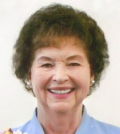

My grandma, Afton Tew, passed away last week - [Sunday Dec. 27 2015](http://www.legacy.com/obituaries/hjnews/obituary.aspx?n=afton-tew&pid=177092980&fhid=6864) after 86 years of tremendous influence. She was a wonderful person that helped so many people.

There was a wonderful service held in her honor. Many showed up to pay tribute. Her children spoke and sang songs. Grandchildren from across the country were there. It was, all-in-all, a wonderful service. Exactly how grandma would have liked it to be.

I loved Afton Tew.

Nearly ten years ago, when I was a teenager, I had the opportunity to live with grandma. Things were difficult at my home with parents and school, so I left and went to my grandmas house. While there, she made it a point to help me in any way that she could. She found out foods I liked, would drive me to classes, tried to help me make friends, and helped me learn to play the piano.

In later years, I didn't have work, but she employed me to do yard work for her. This helped pay for my school when until I got a job elsewhere.

After getting married, my wife and I had a reception at her house and later lived in her basement apartment. We would often come up and talk with grandma, help with her computer related woes, rake leaves, shovel snow, and mow the lawn. We even had our first child while living there.

Life won't be the same without grandma, but after decades without her husband, years of physical struggle and living alone, I know she's in a better place.